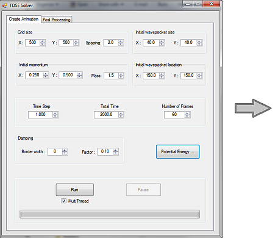

# TDSE

This project implements solvers for the time-dependent Schrodinger equation. 

Currently there are three solvers, for one particle in two dimensions, one particle in three dimensions,
and two particles in two dimensions. (I plan to add more solvers in the future.)

A UI is provided for entering quantities such as the average position and momentum of the initial wavepacket, the 
potential energy function, the grid size, etc. The output is a set of vtk files that can be rendered in ParaView.

See the "Sample Outputs" folder for some results.  

&nbsp;

